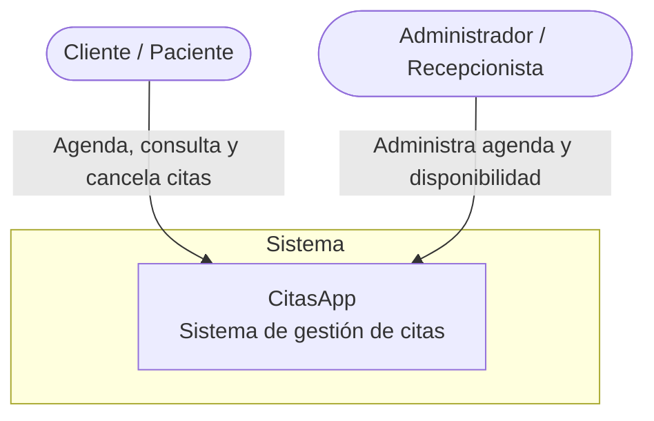

# Arquitectura de CitasApp — Modelo C4

Este documento describe la arquitectura de **CitasApp** usando el Modelo C4, en tres niveles de detalle progresivo. Todos los diagramas están escritos como código (Mermaid) para que se versionen junto con el resto del repositorio.

---

## Nivel 1 — Contexto

**¿Para quién es este diagrama?** Para cualquier persona sin conocimiento técnico (un stakeholder, un cliente, un compañero de otro equipo) que quiere entender qué hace el sistema y quién lo usa, sin entrar en detalles de tecnología.

**¿Qué pregunta responde?** *¿Qué es CitasApp y quién interactúa con él?*

